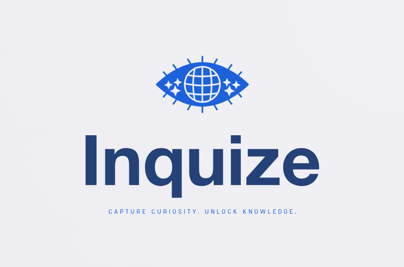

# Inquize - Capture curiosity. Unlock knowledge.



**Inquize** is a revolutionary mobile application that transforms how you interact with the world. By leveraging your camera and the advanced AI of the **Gemini SDK**, you can point your device at any object, place, or thing that sparks your curiosity and instantly ask questions. **Inquize** provides you with precise and detailed answers in real-time, turning every interaction into a learning opportunity.

Whether you're at a museum, exploring nature, or simply at home, **Inquize** turns your camera into a window to knowledge, allowing you to discover enriched information instantly. Just point, ask, and learn!

<p align="center">
  
  
  
  
  
</p>

## Key Features

- **AI-Powered Visual Exploration:** Use your camera to identify objects, places, or concepts and get instant information.
- **Conversational Interaction:** Ask natural language questions about what you see, and receive detailed answers powered by the **Gemini SDK**.
- **Dynamic Learning:** Transform every moment into a learning opportunity. Discover fun facts, technical info, or history about anything around you.
- **Intuitive Interface:** Built with **Jetpack Compose**, the UI is modern, fluid, and user-friendly, designed for an optimal user experience.

## Technologies Used

- **Kotlin**: Primary programming language.
- **Jetpack Compose**: Declarative UI framework for Android development.
- **Gemini SDK**: Advanced AI engine for image recognition and natural language processing.
- **Coroutines**: For efficient asynchronous task handling.
- **Hilt/Dagger**: For dependency injection.
- **Retrofit**: For handling network communications.
- **Coil**: For loading and manipulating images in the UI.
- **Room**: For local data storage (optional).

## Project Setup

### Prerequisites

- **Android Studio Flamingo (or later)** installed.
- **Android SDK 33** or later.
- Internet connection to interact with the **Gemini SDK**.

### Steps to Clone and Set Up the Project

1. Clone the repository to your local machine:

   ```bash
   git clone https://github.com/your-username/inquize.git
   cd inquize
